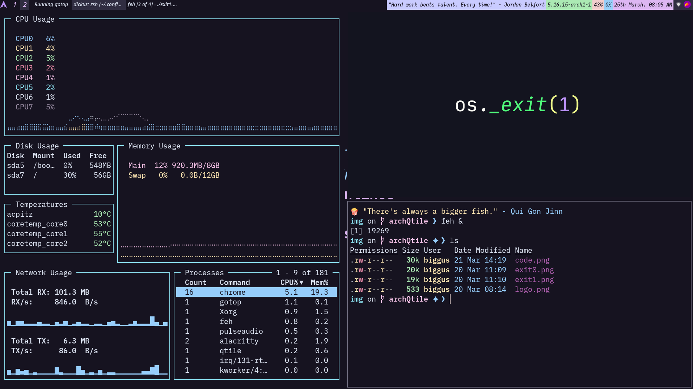

# dotfiles

These are my .dotfiles. There are many like it but my .dotfiles are mine and I love them.

## Using these .dotfiles

I wrote a script to install all this. A script which I have yet to test.

Run that script with this one command after a fresh Arch Linux install:

```
bash <(curl -s https://github.com/linuxdotexe/.dotfiles/blob/archQtile/configs/install.sh)
```

Here is a picture to see how awesome my setup is



- Theme: [catppuccin](https://github.com/catppuccin)
- Font: [BlexMono Nerd Font](https://github.com/ryanoasis/nerd-fonts/tree/master/patched-fonts/IBMPlexMono)
- Terminal: [Alacritty](https://github.com/alacritty/alacritty)
- Resource Monitor: [gotop](https://github.com/cjbassi/gotop)
- Image Viewer: [feh](https://github.com/derf/feh)

Quotes displayed in the terminal and the WM are from a bunch of quotes I gather for a fun little CLI application I made, [psmq](https://github.com/linuxdotexe/psmq). The quotes are smaller for the WM and are inside the `qtile` folder. To get commands in the WM, psmq is not required.

## Contributing

You can contribute to this repository by doing the following:

- Optimizing the [qtile config](https://github.com/linuxdotexe/.dotfiles/blob/archQtile/qtile/.config/qtile/config.py).
- Adding new and funnier insults to the [zsh-insulter](https://github.com/linuxdotexe/.dotfiles/blob/archQtile/zsh/.zsh/zsh-insulter/src/zsh.command-not-found)
- Adding code-y wallpapers to the [qtile's img folder](https://github.com/linuxdotexe/.dotfiles/tree/archQtile/qtile/.config/qtile/img)
- **Wacky wildcards**: Anything other than the above mentioned things :)

Feel free to make an issue or PR. Both are very welcome.

## Contributors

Hearty thanks to [@himabindu-run](https://github.com/himabindu-run) for pointing out a typo in the insults and fixing it.
